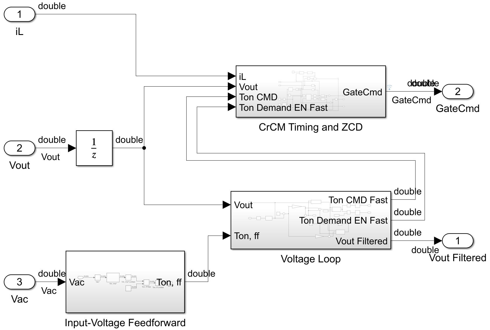
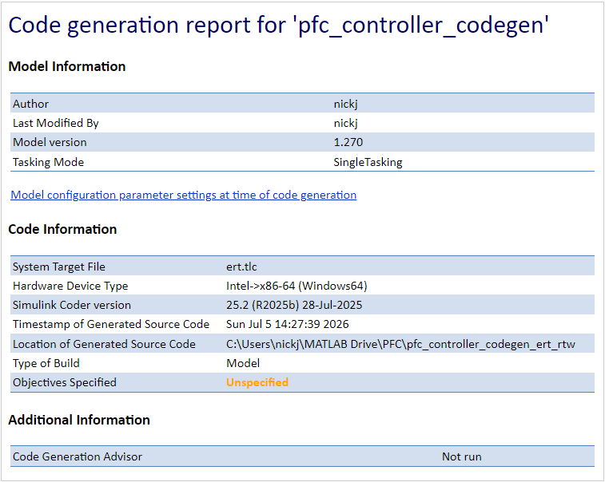
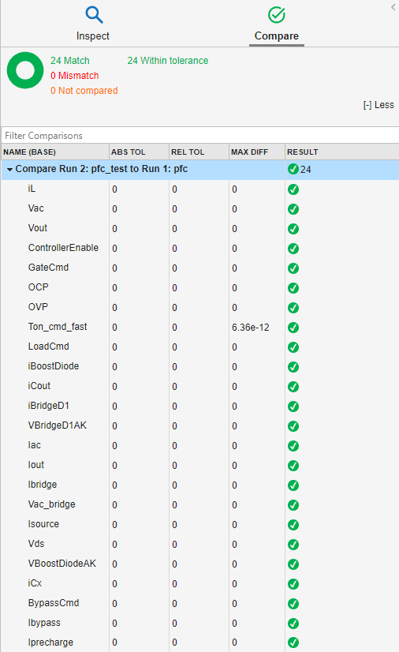
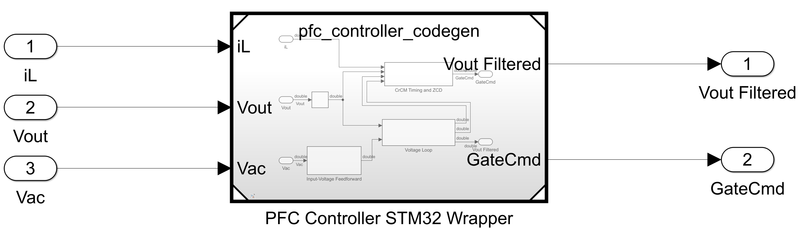
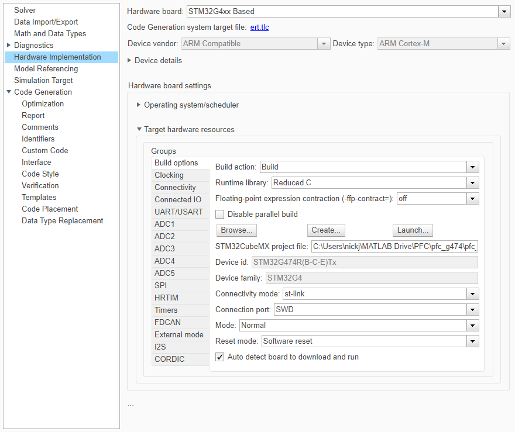
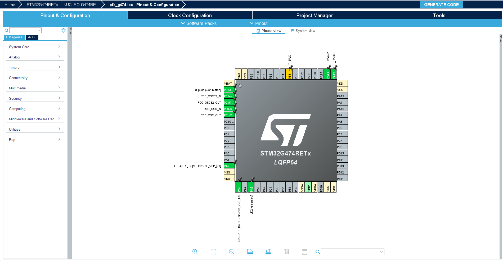

# CrCM Boost PFC — Embedded Code Generation and STM32 Implementation

## Purpose and scope

This document summarizes the conversion of the CrCM boost-PFC controller from a Simulink implementation into generated C code and an STM32G4-targeted firmware build.

The work described here verifies three separate stages:

1. The controller was isolated from the Simscape electrical plant in a code-generation-compatible model.
2. The generated C implementation was compared against normal Simulink execution using software-in-the-loop testing.
3. The controller hierarchy was cross-compiled and linked for an STM32G4 target.

The current result is a verified software implementation and a successful build-only STM32 firmware target. It is not yet a complete physical PFC controller because the STM32 ADC, comparator, HRTIM, protection, and gate-driver interfaces have not been integrated or tested on hardware.

---

## Model organization

The project separates the electrical plant, controller algorithm, and target-specific wrapper.

```text
pfc.slx
    Full Simulink/Simscape PFC plant and controller simulation

pfc_controller_codegen.slx
    Discrete controller-only model used for generated C and SIL

pfc_controller_stm32.slx
    STM32G4 deployment wrapper that references the controller model

pfc_g474.ioc
    STM32CubeMX project for the selected STM32G4 hardware profile
```

This structure keeps the controller algorithm independent of the physical-network model and avoids placing Simscape or electrical blocks in the code-generation component.

---

## Controller-only code-generation model

The controller-only model exposes three inputs and two outputs:

```text
Inputs:
iL
Vout
Vac

Outputs:
GateCmd
Vout Filtered
```

The internal controller is organized around:

- Input-voltage feedforward
- Output-voltage filtering and voltage-loop control
- On-time command limiting
- Zero-current-detection and restart logic
- Minimum switching-period enforcement
- Cycle-by-cycle current limiting
- Output overvoltage protection
- Startup and demand-enable logic

The model contains only discrete Simulink logic. Simscape electrical elements and physical signals remain in the original PFC simulation model.

<p align="center">
  
</p>
<p align="center">
  <em>Controller-only model containing feedforward, voltage-loop, and CrCM timing logic.</em>
</p>

---

## Timing configuration

The controller parameters define two primary rates:

```text
Fast controller sample time:       100 ns
Voltage-loop sample time:          100 us
Voltage-loop rate ratio:           1000 fast steps
```

The model uses:

```text
Solver type:                       Fixed-step
Solver:                            Discrete, no continuous states
Fundamental sample time:           100 ns
Tasking mode:                      Single-tasking
```

The generated scheduler calls the fast controller logic at the base rate and executes the voltage-loop subrate once every 1000 base steps.

A maximum requested switching frequency of `500 kHz` corresponds to a nominal minimum cycle period of `2 us`, or 20 fast-controller samples. The measured switching-frequency ceiling in the final simulation was approximately `476.190 kHz` because of sampled restart and edge-detection timing.

---

## Code-generation preparation

Several model details were checked before code generation:

- The controller model used a fixed-step discrete solver.
- Root Inports were assigned explicit discrete sample times.
- Simulation-only electrical and physical-network blocks were excluded.
- The controller hierarchy used compatible single-tasking settings.
- The voltage-loop and fast-control rates were preserved explicitly.
- A continuous-time Zero-Order Hold at the input boundary was removed after the root input was made explicitly discrete.
- Internal signals used for SIL inspection were configured for logging and, where required, preserved as test points.

The controller was generated with Embedded Coder using the Embedded Real-Time target:

```text
System target file:                ert.tlc
Generated language:                C
Code interface:                    Model
```

The first host build targeted Windows x86-64 and was compiled with MinGW for software-in-the-loop execution.

---

## Generated controller interface

The generated controller has entry points equivalent to:

```c
void pfc_controller_codegen_initialize(void);
void pfc_controller_codegen_step(void);
void pfc_controller_codegen_terminate(void);
```

Root inputs and outputs are represented through generated structures equivalent to:

```c
pfc_controller_codegen_U.iL
pfc_controller_codegen_U.Vout
pfc_controller_codegen_U.Vac

pfc_controller_codegen_Y.GateCmd
pfc_controller_codegen_Y.VoutFiltered
```

The exact generated declarations are contained in:

```text
pfc_controller_codegen.h
```

The generated model also contains internal signal and state structures for filters, delays, counters, latches, and multirate scheduling.

<p align="center">
  
</p>
<p align="center">
  <em>Embedded Coder report summary for the controller-only model, showing the ERT target, single-tasking configuration, host architecture, and generated-source location.</em>
</p>

---

## Software-in-the-loop verification

Software-in-the-loop testing was used to compare:

```text
Normal Simulink controller execution
versus
Compiled generated C execution
```

The same model inputs were applied to both executions. Representative logged signals included:

- `GateCmd`
- `Vout Filtered`
- `Zero Ready`
- On-time and timing signals
- Protection and enable signals

The compared signals matched for the test cases used.

An initial comparison showed `Vout Filtered` remaining at zero because the standalone controller model had not been supplied with nonzero root-input test data. After the test inputs and internal signal instrumentation were configured correctly, the normal and SIL results matched.

The SIL result verifies numerical equivalence between `pfc_controller_codegen.slx` and the generated C implementation for the exercised input data. It does not verify real-time execution deadlines, STM32 peripheral behavior, or analog measurement accuracy.

<p align="center">
  
</p>
<p align="center">
  <em>Representative comparison showing matching normal-simulation and SIL controller signals.</em>
</p>

---

## STM32 deployment wrapper

The target-specific model is:

```text
pfc_controller_stm32.slx
```

It references `pfc_controller_codegen.slx` through a Model block. During the first build-only verification, temporary root Inports and Outports were used around the referenced controller:

```text
iL   ──┐
Vout ──┼── pfc_controller_codegen ── GateCmd
Vac  ──┘                           ── Vout Filtered
```

These top-level ports currently represent software interfaces only. They have not yet been replaced with STM32 ADC, comparator, HRTIM, PWM, GPIO, or fault-peripheral blocks.

Separate host/SIL and STM32 deployment configurations were maintained so the same controller algorithm could be tested on the host and cross-compiled for the embedded target.

<p align="center">
  
</p>
<p align="center">
  <em>STM32 deployment wrapper containing the controller Model block.</em>
</p>

---

## STM32 target configuration

The selected target configuration is:

```text
MCU family:                         STM32G4
Hardware profile:                   NUCLEO-G474RE
Target MCU:                         STM32G474RE family
Compiler:                           GNU Tools for ARM Embedded Processors
Configuration tool:                 STM32CubeMX
CubeMX project:                     pfc_g474.ioc
Build action:                       Build only
```

`Build only` was used because no physical STM32 board was connected. This mode generates, compiles, and links the firmware without attempting to flash or start the target.

All models participating in the model-reference hierarchy were configured with compatible target, toolchain, tasking, and CubeMX settings.

<p align="center">
  
</p>
<p align="center">
  <em>STM32G4 hardware and GNU Arm toolchain configuration.</em>
</p>

<p align="center">
  
</p>
<p align="center">
  <em>STM32CubeMX project for the NUCLEO-G474RE target used during the initial build-only firmware verification.</em>
</p>

---

## STM32 cross-build result

The STM32 build completed successfully and produced target firmware artifacts:

```text
pfc_controller_stm32.elf
pfc_controller_stm32.hex
pfc_controller_stm32.bin
```

The build confirms that the model hierarchy can:

- Generate C for the controller and wrapper
- Compile with the GNU Arm embedded toolchain
- Link against the selected STM32G4 target configuration
- Produce standard STM32 firmware images

A packaged archive of generated source and build artifacts was also created:

```text
pfc_controller_stm32.zip
```

The source archive is useful for inspection, relocation, or later integration into an STM32 development workflow. Generated build folders and cache files are reproducible and do not need to be committed to the main source repository.

---

## Verification status

| Verification item | Status |
|---|---|
| Controller-only model builds with Embedded Coder | Complete |
| Generated C compiles on the host | Complete |
| Normal simulation versus SIL comparison | Complete |
| Logged controller outputs match in SIL | Complete |
| STM32G4 controller hierarchy cross-compiles | Complete |
| ELF, HEX, and BIN images generated | Complete |
| Physical STM32 deployment | Not performed |
| STM32 ADC integration | Not implemented |
| HRTIM gate-pulse generation | Not implemented |
| Comparator-based ZCD and fast protection | Not implemented |
| Target execution-time profiling | Not performed |
| PIL comparison on the STM32 target | Not performed |

---

## Important implementation limitation

The current controller model uses a `100 ns` fast sample time, equivalent to a `10 MHz` base-step rate.

That timing is useful in simulation for sampled ZCD, current-limit, latch, and gate-command behavior. It is not realistic to execute the complete generated controller step as a conventional software interrupt every 100 ns on an STM32G474. The generated step contains control flow, floating-point arithmetic, filtering, state updates, protection logic, and subrate scheduling.

A practical STM32 implementation should partition the controller as follows:

### Hardware-timed functions

Use STM32 HRTIM, comparators, and event/fault inputs for:

- Gate-pulse set and reset events
- Programmed on-time termination
- Zero-current-detection restart events
- Cycle-by-cycle current limiting
- Minimum off-time or minimum-cycle enforcement
- Immediate fault shutdown

### CPU-executed functions

Use generated software for:

- Output-voltage filtering
- Voltage-loop PI control
- Input-voltage feedforward
- On-time command calculation
- Slow protection supervision
- Startup and operating-state management
- Updating HRTIM compare or period values

This partition preserves fast deterministic switching behavior without requiring the CPU to reproduce every 100 ns simulation step.

---

## Required hardware integration

Before the firmware can control a physical PFC converter, the STM32 wrapper must be extended with:

1. **ADC acquisition**
   - Rectified input-voltage measurement
   - Output-voltage measurement
   - Inductor-current measurement where needed
   - ADC count-to-engineering-unit scaling
   - Offset and gain calibration

2. **HRTIM configuration**
   - Gate output pin
   - Pulse set/reset events
   - On-time compare update
   - Minimum-cycle enforcement
   - Safe output state and dead-time behavior where applicable

3. **Comparator and event routing**
   - ZCD comparator input
   - Overcurrent comparator input
   - HRTIM external-event or fault routing
   - Hardware response independent of CPU latency

4. **Protection and startup**
   - Gate-disable default state
   - OVP and OCP shutdown behavior
   - Precharge and bypass relay outputs
   - Controller-enable and load-connect sequencing
   - Fault recovery and restart behavior

5. **Target validation**
   - GPIO and timer bring-up
   - ADC reading verification
   - Oscilloscope verification of HRTIM outputs
   - Execution-time profiling
   - Processor-in-the-loop comparison
   - Low-voltage isolated power-stage testing before high-voltage operation

---

## Generated and source files

The source files that define the implementation are:

```text
pfc_controller_codegen.slx
pfc_controller_stm32.slx
controller_params.m
pfc_g474.ioc
```

The generated firmware artifacts are:

```text
pfc_controller_stm32.elf
pfc_controller_stm32.hex
pfc_controller_stm32.bin
```

The generated-source package is:

```text
pfc_controller_stm32.zip
```

Cache and build directories such as the following are reproducible:

```text
slprj/
*_ert_rtw/
*.slxc
*.mexw64
```

They are useful locally but should normally be excluded from the primary Git repository.

---

## Result

The CrCM PFC controller was successfully converted into generated C, verified against the Simulink implementation using SIL, and cross-compiled into STM32G4 ELF, HEX, and BIN firmware artifacts.

The current build demonstrates model-to-code equivalence and target-build compatibility. Completion of the embedded controller requires peripheral integration, timing partitioning, physical-board deployment, and hardware validation.
