# CrCM Boost PFC — Final Project Summary

## Project objective

A critical-conduction-mode boost power-factor-correction converter was developed and verified in Simulink/Simscape for:

```text
Input voltage:       90–264 VAC
Line frequency:      50/60 Hz
Output voltage:      400 VDC
Rated output power:  100 W
Rated load:          1600 ohm
Target PF:           > 0.95
Target efficiency:   > 92%
```

The final model includes:

- A full-wave bridge rectifier
- A differential-mode EMI input filter
- A boost power stage operating in critical conduction mode
- Zero-current detection and controlled cycle restart
- Input-voltage feedforward
- An outer voltage loop with dynamically bounded integral action
- Minimum-on-time demand inhibition
- A maximum-switching-frequency clamp
- Cycle-by-cycle overcurrent protection
- Hysteretic output overvoltage protection
- Precharge, bypass, controller-enable, startup-pulse, and load-connect sequencing
- A temporary low-line startup on-time limit
- Charge-balanced current post-processing for switched-current stress calculations

The reported efficiency is a **modeled efficiency**. The simulation does not fully include MOSFET switching energy, gate-drive loss, output-capacitance loss, diode reverse recovery, magnetic core loss, controller auxiliary power, detailed thermal behavior, or layout-dependent parasitic spikes.

---

<p align="center">
    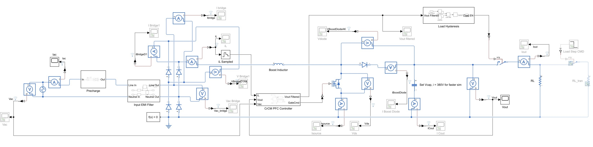
</p>

# Final power-stage parameters

```text
Boost inductance:                 270 uH
Inductor series resistance:       0.1 ohm

Output capacitance:               220 uF
Output-capacitor ESR:             0.3 ohm

Rated load resistance:            1600 ohm
50% load resistance:              3200 ohm
20% load resistance:              8000 ohm
No-load test resistance:          1 Gohm

EMI-filter inductors:             2 x 1 mH
EMI winding resistance:           0.05 ohm each
X capacitor:                      100 nF
X-capacitor ESR:                  0.2 ohm

Precharge resistor:               82 ohm
```

For the load-step tests, the load was implemented as:

```text
Base 20% load:                    8000 ohm
Switched additional branch:       2000 ohm
Combined full load:               8000 || 2000 = 1600 ohm
```

---

<p align="center">
    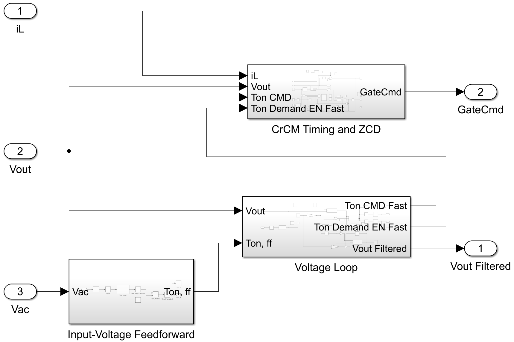
</p>

# Final controller structure

## Sampling

```text
Fast control sample time:         100 ns
Voltage-loop sample time:         100 us
```

## Protection

```text
OCP threshold:                    4.0 A
OVP turn-on threshold:            420 V
OVP release threshold:            410 V
ZCD threshold:                    0.02 A
```

OVP is implemented with hysteresis. While OVP is active, new switching cycles are blocked and the latch is reset. Switching can restart after Vout falls below the release threshold and the normal ZCD/frequency conditions are again valid.

## Vin feedforward and absolute on-time limit

```matlab
Ton_ff = 0.05751 / Vin_rms^2;

Ton_dynamic_max = min( ...
    Ton_abs_max_selected, ...
    1.25 * Ton_ff);
```

```text
Normal absolute maximum Ton:      8.0 us
Temporary startup maximum Ton:    7.5 us
```

The startup limit remains active until `Vout_filtered` exceeds `390 V`. Relay hysteresis returns to the startup limit if Vout falls below `370 V`.

## Dynamically bounded integral term

The earlier fixed `±1 us` integral clamp did not provide enough negative control authority at reduced load. The final voltage-loop integrator uses dynamic limits based on the proportional and feedforward contribution:

```matlab
Ton_base  = Ton_ff + Ton_P;
Ton_I_min = -Ton_base;
Ton_I_max = Ton_dynamic_max - Ton_base;

Ton_I_candidate = Ton_I_previous + Ton_I_increment;
Ton_I_limited   = min(max(Ton_I_candidate, Ton_I_min), Ton_I_max);

Ton_request = Ton_base + Ton_I_limited;
```

The limited value is stored as the next integrator state, providing direct anti-windup without the earlier conditional-integration subsystem that caused an algebraic loop.

## Minimum-pulse demand logic

The final timer command is never lower than `0.2 us`, but switching is inhibited when the controller requests effectively zero power.

```text
Demand-enable relay ON threshold:   0.25 us
Demand-enable relay OFF threshold:  0.15 us
Minimum timer command:              0.20 us
```

```matlab
Ton_cmd = max(Ton_request_limited, 0.2e-6);
```

`TonDemandEnable` is placed before the restart edge detector and in the SET-enable path. It is **not** placed in the latch RESET path. Therefore:

- A request below `0.15 us` prevents new cycles.
- A request above `0.25 us` permits switching to restart.
- The timer continues to receive a valid minimum value, but no pulse is generated while demand-enable is false.

## ZCD, restart, and maximum-frequency clamp

A new switching cycle requires all of the following:

```text
Inductor current below the ZCD threshold
MOSFET confirmed off
Minimum switching period completed
OVP inactive
Controller enabled
Ton demand enabled
```

The maximum-frequency clamp uses a 20-sample minimum-period counter at the `100 ns` fast sample time:

```text
Requested ceiling:                 500 kHz
Nominal minimum period:            2.0 us
Counter threshold:                 20 samples
Measured maximum switching rate:   476.190 kHz
```

The measured ceiling is lower than the ideal 500 kHz because restart, edge detection, and sampled timing add one effective discrete interval.

---

<p align="center">
    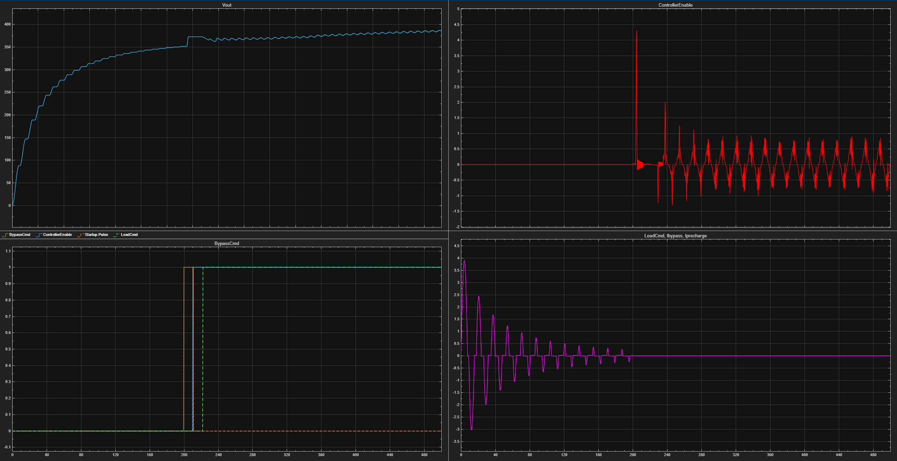
</p>
<p align="center">
  <em>Figure 1. Startup sequencing timing plots showing correct behavior on precharging and bypassing.</em>
</p>


# Final startup sequence

```text
0.000–0.200 s:
Precharge resistor active
Bypass open
Controller disabled
Load disconnected

0.200 s:
Bypass switch closes

0.210 s:
Controller enabled

0.211 s:
Startup pulse initiates the first active switching cycle

0.212 s:
Load-control logic is armed
The load remains disconnected until Vout crosses the 370 V load-ON threshold

Approximately 0.22 s in the plotted startup case:
LoadCmd asserts and the load connects
```

Load-connection hysteresis:

```text
Load ON threshold:                 370 V
Load OFF threshold:                340 V
```

A `100 us` Unit Delay after the raw load command breaks the electrical/control algebraic loop.

---

# Final verification matrix

The final simulation set includes:

## Startup

- `90 V, 50 Hz, 100% load`
- `264 V, 60 Hz, 100% load`

## Rated-load steady state

- `90 V, 50 Hz, 100% load`
- `120 V, 60 Hz, 100% load`
- `230 V, 50 Hz, 100% load`
- `240 V, 60 Hz, 100% load`
- `264 V, 60 Hz, 100% load`

## Reduced and no-load steady state

- `120 V, 60 Hz, 50% load`
- `120 V, 60 Hz, 20% load`
- `120 V, 60 Hz, no load`
- `240 V, 60 Hz, 20% load`
- `240 V, 60 Hz, no load`

## Load-step tests

- `120 V, 60 Hz, 20% → 100%`
- `240 V, 60 Hz, 100% → 20%`
- `264 V, 60 Hz, 100% → 20%`, with the step placed near a line-voltage peak

A separate `240 V, 50%` test was not required. The high-line operating range was already bounded by full load, 20% load, no load, and a full-to-light-load transient. Intermediate-load control was also verified at `120 V, 50%`.

---

# Rated-load steady-state validation

The final refreshed corner runs used the `4.8–5.0 s` measurement interval. This contains 10 complete line cycles at 50 Hz and 12 complete line cycles at 60 Hz.

| Input condition | True PF | Modeled efficiency | Average Vout | Vout ripple | Average Ton | Maximum Fsw |
|---|---:|---:|---:|---:|---:|---:|
| `90 V, 50 Hz` | `0.999664` | `96.171%` | `400.011 V` | `4.482 Vpp` | `6.596 us` | `147.059 kHz` |
| `120 V, 60 Hz` | `≈0.999715` | `≈97.307%` | `399.782 V` | `3.688 Vpp` | `≈3.697 us` | `256.410 kHz` |
| `230 V, 50 Hz` | `≈0.994517` | `≈98.198%` | `399.660 V` | `4.318 Vpp` | `≈0.899 us` | `476.190 kHz` |
| `240 V, 60 Hz` | `≈0.993675` | `≈98.215%` | `399.763 V` | `3.625 Vpp` | `≈0.806 us` | `476.190 kHz` |
| `264 V, 60 Hz` | `0.991258` | `98.108%` | `400.008 V` | `4.169 Vpp` | `0.686 us` | `476.190 kHz` |

The `90 V, 50 Hz` and `264 V, 60 Hz` cases were rerun after the final controller changes. Both passed regulation, PF, efficiency, and steady-state protection checks.

```text
Worst refreshed rated-load PF:           0.991258
Required PF:                             > 0.95
Result:                                  PASS

Worst refreshed rated-load efficiency:   96.171%
Required modeled efficiency:             > 92%
Result:                                  PASS
```

OVP and OCP remained inactive in the final rated-load steady-state measurement windows.

### 90V / 50Hz Plots
<p align="center">
    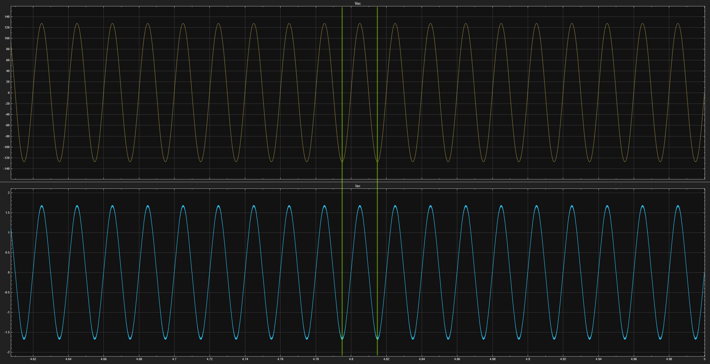
</p>
<p align="center">
  <em>Figure 2. 90V / 50Hz input showing input current matching input AC voltage's sinuosoidal shape.</em>
</p>


<p align="center">
    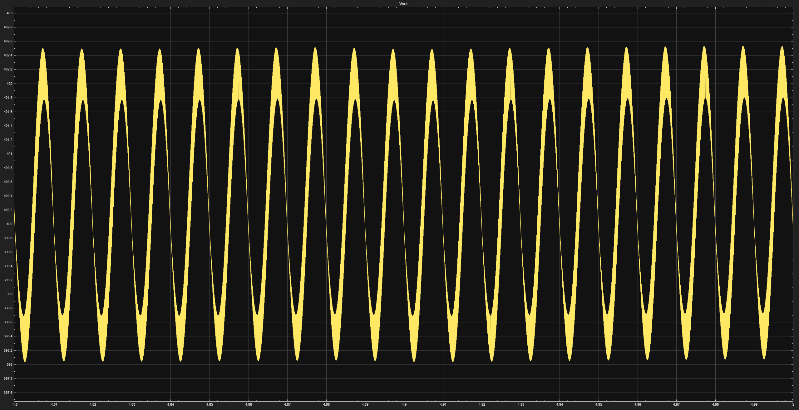
</p>
<p align="center">
  <em>Figure 3. 90V / 50Hz output plot.</em>
</p>

### 264V / 60Hz Plots
<p align="center">
    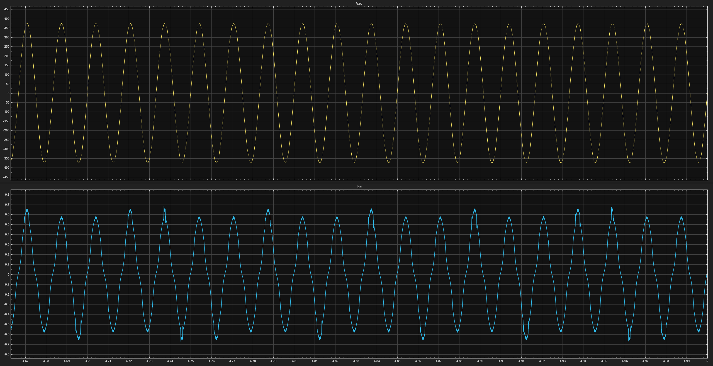
</p>
<p align="center">
  <em>Figure 4. 264V / 60Hz input plot.</em>
</p>

<p align="center">
    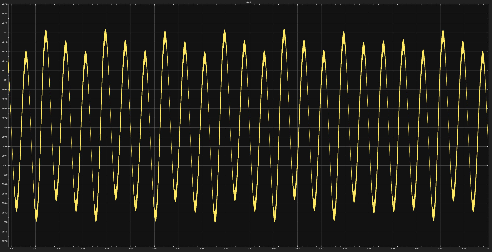
</p>
<p align="center">
  <em>Figure 5. 264V / 60Hz output plot.</em>
</p>

---

# Reduced-load and no-load validation


<p align="center">
  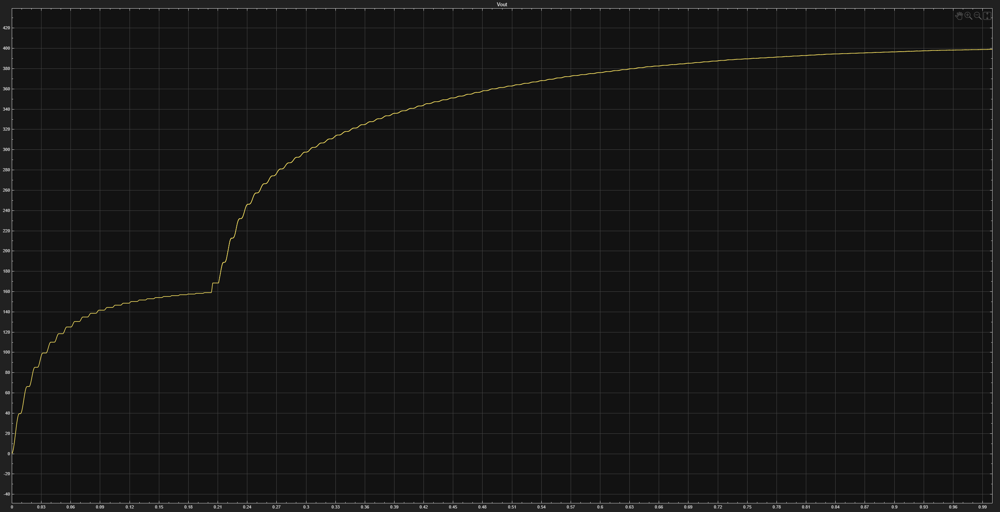
  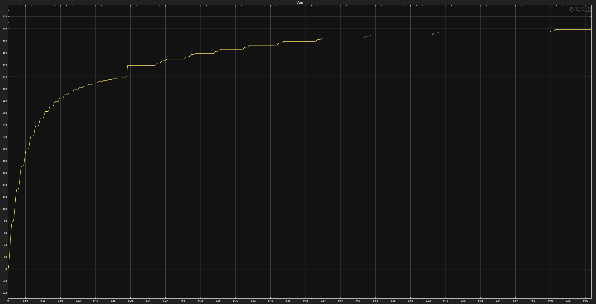
</p>
<p align="center">
  <em>Figure 5. No-load bus-voltage behavior at 120 V and 240 V. The bus remains bounded near 400 V; the 240 V case shows larger staircase-like energy increments during pulse-skipping startup.</em>
</p>


<p align="center">
  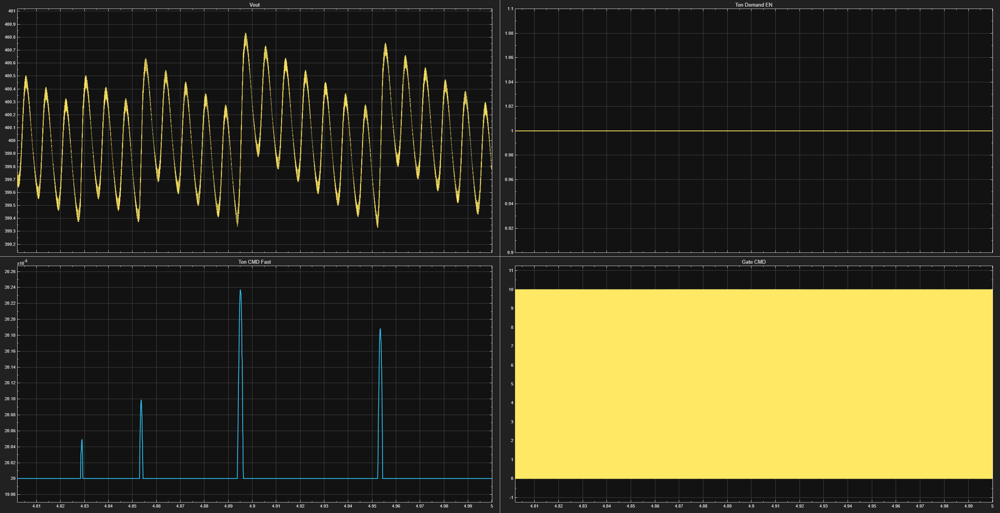
</p>
<p align="center">
  <em>Figure 6. Minimum-pulse and demand-enable behavior at 240 V, 20% load. The requested on-time approaches the minimum region while the hysteretic demand-enable logic prevents invalid subminimum switching pulses.</em>
</p>


| Operating point | True PF | Modeled efficiency | Average Vout | Ripple | Key behavior |
|---|---:|---:|---:|---:|---|
| `120 V, 50%` | `0.999708` | `97.405%` | `400.003 V` | `1.900 Vpp` | Normal continuous CrCM operation |
| `120 V, 20%` | `0.988762` | `96.461%` | `400.000 V` | `1.014 Vpp` | Operates at the frequency ceiling |
| `120 V, no load` | N/A | N/A | `401.216 V` | `0.015 Vpp` | No gate pulses in the 4–5 s window |
| `240 V, 20%` | `0.916414` | `95.406%` | `399.983 V` | `1.417 Vpp` | Minimum Ton and frequency ceiling active |
| `240 V, no load` | N/A | N/A | `402.023 V` | `0.010 Vpp` | No gate pulses in the 4–5 s window |

No-load input results:

```text
120 V no-load input power:          0.143 W
120 V no-load input RMS current:    4.68 mA

240 V no-load input power:          0.575 W
240 V no-load input RMS current:    9.36 mA
```

At no load, PF and efficiency are not meaningful compliance metrics because output power is essentially zero. The relevant checks are bus-voltage containment, idle input power, protection state, and correct pulse inhibition.

The high-line `240 V, 20%` case is the only loaded operating point that did not meet the `PF > 0.95` target:

```text
Measured true PF:                   0.916414
Modeled efficiency:                 95.406%
Average Vout:                       399.983 V
```

Regulation and efficiency still passed. The PF limitation is caused by the combination of:

- The `0.2 us` minimum on-time
- The approximately `476 kHz` realized switching-frequency ceiling
- High-line, low-power current-envelope distortion

The current design was retained because rated-load PF passes across the input range and the added complexity of high-line light-load compensation was not justified for the project scope.

---

# Startup validation

## High-line startup: 264 V, 60 Hz

```text
Peak input/bypass current:          4.314 A
Precharge current peak:             3.903 A
Boost-inductor peak:                4.312 A
MOSFET branch peak:                 1.644 A

Maximum Vout:                       410.406 V
Maximum MOSFET Vds:                 411.281 V
Boost-diode reverse voltage:        410.142 V
Bridge-diode reverse voltage:       445.614 V
```

Retained precharge estimates:

```text
Peak precharge-resistor power:      1249 W
Precharge energy:                   11.739 J
Precharge I^2*t:                    0.143 A^2*s
```

The approximately `4.31 A` high-line event is a passive bypass/inrush current. It is not MOSFET OCP current. The MOSFET branch remained at approximately `1.64 A`.

```text
OVP:                                no trip
OCP:                                no trip
```

## Low-line startup: 90 V, 50 Hz

```text
Peak input/bypass current:          2.166 A
Precharge current peak:             1.287 A
Boost-inductor peak:                4.111 A
MOSFET branch peak:                 4.054 A

Maximum Vout:                       409.209 V
Maximum MOSFET Vds:                 410.633 V
Boost-diode reverse voltage:        408.455 V
Bridge-diode reverse voltage:       220.109 V
```

A brief cycle-by-cycle OCP indication occurred near startup. The approximately `0.054 A` sampled overshoot above the `4 A` threshold is consistent with the `100 ns` comparator and latch-reset timing.

```text
OVP:                                no trip
OCP:                                brief controlled limiting
Startup completed:                  yes
```

---

# Load-step validation


<p align="center">
  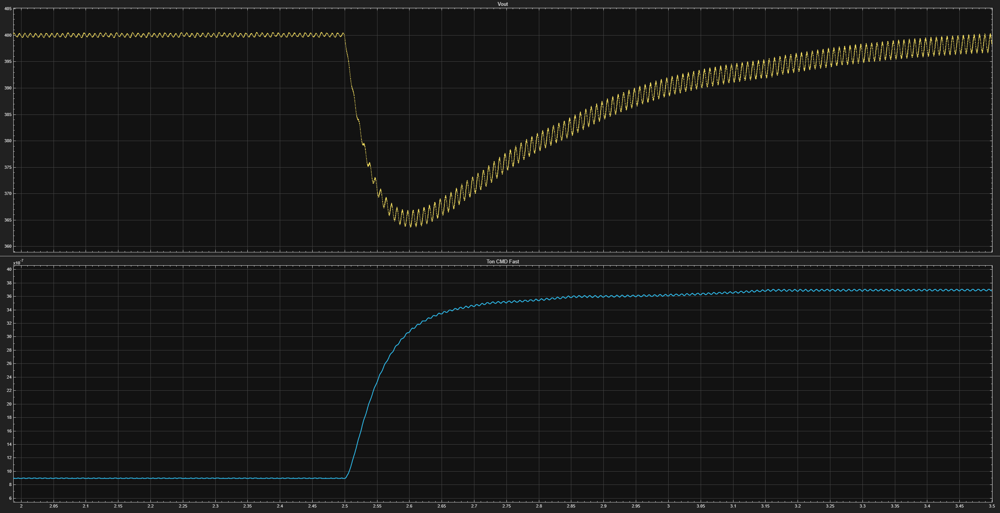
</p>
<p align="center">
  <em>Figure 7. 120 V, 20% → 100% load-step response. Vout exhibits a controlled undershoot and the on-time command moves from the light-load value to the full-load value.</em>
</p>


<p align="center">
  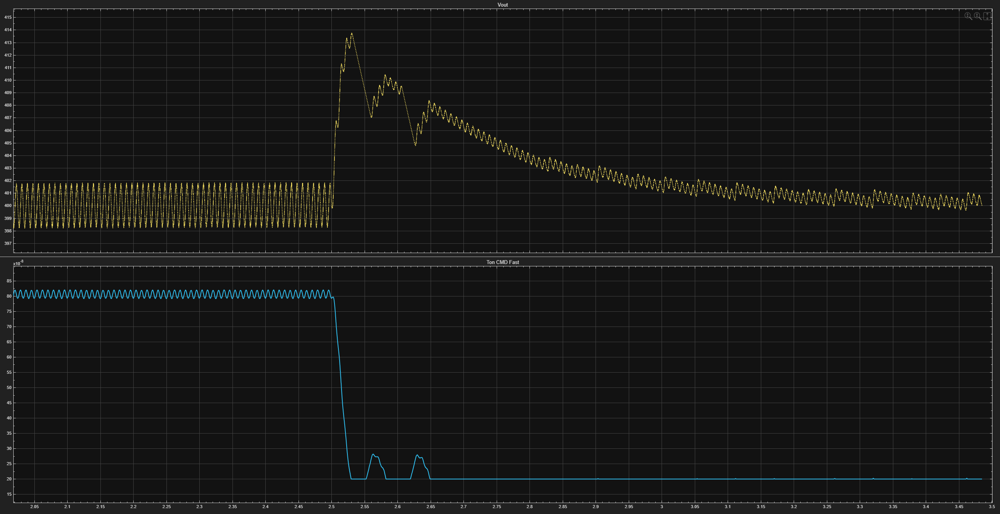
</p>
<p align="center">
  <em>Figure 8. 240 V, 100% → 20% load-step response. The output-voltage overshoot remains below the 420 V OVP threshold and returns to the regulated operating point.</em>
</p>


<p align="center">
  
  
  
  
</p>
<p align="center">
  <em>Figure 9. 264 V near-line-peak worst-case load-removal test. The measured Vout peak was 413.1815 V, leaving 6.8185 V below the OVP threshold. OVP and OCP remained inactive.</em>
</p>


## 120 V, 20% → 100%

The output voltage dipped when the load changed from approximately `20 W` to `100 W`.

```text
Approximate minimum Vout:           365–367 V
Approximate undershoot:             33–35 V
Recovery to near 400 V:             about 1 s
OVP:                                inactive
Post-step output power:             99.999 W
Post-step PF:                       0.999733
Post-step modeled efficiency:       97.298%
```

The response was stable and returned to the expected full-load operating point.

## 240 V, 100% → 20%

The output voltage overshot after removing 80% of the load.

```text
Approximate transient peak:         413–414 V
OVP threshold:                      420 V
OVP/OCP:                            inactive
Post-step output power:             20.000 W
Post-step modeled efficiency:       95.260%
Post-step PF:                       0.914614
```

The post-step PF reproduces the known high-line, 20% limitation.

## 264 V, 100% → 20%, near line peak

A final worst-case load-removal check was run at the maximum input voltage with the step placed near a line-voltage peak.

```text
Measured peak Vout:                 413.1815 V
OVP threshold:                      420.0000 V
Remaining OVP margin:               6.8185 V
OVP/OCP:                            inactive
Recovery:                           stable
```

This was the highest measured output voltage across the final test set.

---


<!-- FIGURE PLACEHOLDER 10: Replace this block with an image when available. -->
<p align="center">
  <strong>Figure 10 placeholder — Component-stress measurement locations</strong><br>
  <em>Suggested content: an annotated schematic identifying Iac, Iprecharge, Ibypass, Ibridge, iL, Isource, iBoostDiode, iCout, iCx, Iout, Vds, boost-diode voltage, and representative bridge-diode voltage.</em>
</p>

# Steady-state component stress

The largest steady-state current stresses in the final matrix occurred at low line:

| Quantity | Worst steady-state result | Main condition |
|---|---:|---|
| Input-current RMS | `1.156 A` | `90 V, 50 Hz, full load` |
| Boost-inductor peak | `3.365 A` | `90 V, 50 Hz, full load` |
| Boost-inductor RMS | `1.350 A` | `90 V, 50 Hz, full load` |
| MOSFET current peak | `3.324 A` | `90 V, 50 Hz, full load` |
| MOSFET current RMS | `1.149 A` | `90 V, 50 Hz, full load` |
| Bridge-diode peak | `3.365 A` | `90 V, 50 Hz, full load` |
| Bridge-diode RMS | `0.955 A` | `90 V, 50 Hz, full load` |
| Boost-diode peak | `3.361 A` | `90 V, 50 Hz, full load` |
| Boost-diode corrected RMS | `0.704 A` | `90 V, 50 Hz, full load` |
| Output-capacitor peak current | `3.111 A` | `90 V, 50 Hz, full load` |
| Output-capacitor ripple RMS | `0.658 A` | `90 V, 50 Hz, full load` |
| X-capacitor RMS current | `0.706 A` | `90 V, 50 Hz, full load` |

Worst steady-state voltage stresses:

```text
Maximum steady-state Vout:          402.530 V
Maximum steady-state MOSFET Vds:    403.935 V
Maximum boost-diode reverse:        401.861 V
Maximum bridge-diode reverse:       400.697 V
```

Startup produced the largest bridge-diode reverse voltage, while the load-removal transient produced the largest Vout.

---

# Final worst-case simulated stresses

## Current

```text
Highest passive input/bypass current:
4.314 A during 264 V high-line startup

Highest boost-inductor current:
4.312 A during high-line passive inrush

Highest active MOSFET current:
4.054 A during 90 V low-line startup

Highest steady-state MOSFET current:
3.324 A at 90 V, 50 Hz, full load

Highest output-capacitor ripple RMS:
0.658 A at 90 V, 50 Hz, full load
```

## Voltage

```text
Highest output voltage:
413.1815 V during 264 V full-to-20% load removal

Highest startup MOSFET Vds:
411.281 V during 264 V startup

Highest startup boost-diode reverse voltage:
410.142 V during 264 V startup

Highest bridge-diode reverse voltage:
445.614 V during 264 V startup
```

The exact MOSFET and boost-diode voltage peaks during the `264 V` load-removal transient were not separately extracted. They followed the elevated DC-bus waveform and remained below protection activation in the plotted results.

Hardware component ratings should include substantial margin beyond these idealized simulated stresses. The simulation results support using high-voltage devices with margin, such as a 600 V bridge/boost diode class and a 600–650 V MOSFET class, subject to real switching-spike, thermal, and derating analysis.

---

# Charge-balance correction

Discrete-event logging produced a small DC-area bias in the raw switched-current averages. The corrected estimates use:

```text
Expected capacitor average current = C * dV/dt
```

and:

```text
Average boost-diode current
=
average load current
+
average capacitor current
```

The correction removes only the inferred DC offset. Measured peak currents remain unchanged.

Representative corrected results:

```text
90 V full-load output-capacitor ripple RMS:
0.657836 A

90 V full-load boost-diode corrected RMS:
0.703855 A

264 V full-load output-capacitor ripple RMS:
0.330708 A

264 V full-load boost-diode corrected RMS:
0.414808 A
```

The raw boost-diode RMS may still be retained as a conservative component-rating value.

---

# Resolved development issues

## Issue 1: PFC controller burst switching and restart logic

The gate-control sequence was corrected so that a startup pulse initiates the first cycle and later cycles begin only from a valid ZCD restart-state transition. Restart logic was also coordinated with OVP and demand-enable so the converter can recover after switching inhibition.

## Issue 2: Voltage-loop integrator windup

The voltage-loop integral state was limited and stored after saturation to prevent windup.

## Issue 3: Dynamic maximum on-time

The maximum on-time was made dependent on Vin feedforward and an absolute startup/normal ceiling.

## Issue 4: Vin feedforward and varying switching frequency

The feedforward law was corrected for universal-input CrCM operation:

```matlab
Ton_ff = 0.05751 / Vin_rms^2;
```

## Issue 5: Startup inrush and load sequencing

An `82 ohm` precharge resistor, delayed bypass, controller hold-off, load disconnection, and hysteretic load connection reduced the original approximately `46 A` source-current spike to approximately `4.31 A`.

Testing showed that a `0.200 s` bypass time performed better than `0.150 s` with only `50 ms` additional startup delay.

## Issue 6: Switched-current logging bias

Charge-balance correction was added for output-capacitor and boost-diode current statistics.

## Issue 7: Maximum switching-frequency clamp and PF tradeoff

A low maximum-frequency limit significantly degraded high-line PF. A `500 kHz` requested limit restored full-load high-line PF to approximately `0.99`, while the discrete implementation produced a measured maximum of `476.190 kHz`.

Clamp-active on-time compensation was considered but not implemented.

## Issue 8: Low-line startup OCP and temporary on-time limiting

Low-line startup briefly reached the `4 A` OCP threshold. A temporary `7.5 us` startup on-time ceiling reduced startup stress. The brief controlled OCP event was accepted because startup completed normally, Vout remained below OVP, and OCP was inactive in steady state.

## Issue 9: Reduced-load overvoltage and minimum-pulse demand control

A fixed `±1 us` integral limit prevented the controller from reducing the requested on-time sufficiently at reduced load, causing repeated operation against OVP. The integral term was replaced with dynamically calculated limits so the voltage loop could request zero on-time. Hysteretic `TonDemandEnable` logic and a separate `0.2 us` minimum physical timer command were then added to prevent invalid subminimum pulses and support controlled pulse skipping at very light and no load.

The final fix used:

- Dynamically calculated integral limits
- A directly saturated discrete accumulator
- Storage of the limited integral state for anti-windup
- Removal of the algebraic-loop-producing conditional integrator
- A zero-lower-bound final on-time request
- Hysteretic `TonDemandEnable` logic with `0.25 us` turn-on and `0.15 us` turn-off thresholds
- A separate physical minimum timer command of `0.2 us`
- Integration of `TonDemandEnable` into the restart and SR-latch SET paths, while leaving it out of the RESET path so an active pulse is not truncated

The revised controller regulated 50% and 20% load correctly, avoided using OVP as the normal reduced-load regulator, and entered a true no-pulse state at no load. It also restarted correctly after pulse-skipping intervals without becoming stuck on or stuck off.

At `240 V, 20% load`, regulation and modeled efficiency passed, although PF remained below the target because the minimum pulse width and maximum switching-frequency clamp were both active.

---

# Known limitations and interpretation

## High-line light-load PF

The design does not meet `PF > 0.95` at `240 V, 20% load`.

```text
Measured PF:                        0.916414
```

This is a documented light-load limitation rather than a regulation or protection failure.

## No-load PF and efficiency

No-load PF and efficiency values are not treated as requirements. The output power is essentially zero, while the EMI X capacitor and modeled parasitic paths continue to draw current.

## Modeled efficiency

The efficiency values are optimistic relative to hardware because several switching, magnetic, controller, and parasitic losses are not fully modeled.

## OVP margin

The worst measured load-removal peak left:

```text
6.8185 V
```

of margin below the `420 V` OVP threshold. This is a valid simulation pass, but the margin is relatively tight and should be revisited during hardware design or controller tuning.

---

# Final verification status

```text
Low-line startup and OCP behavior:             complete
High-line startup and passive-inrush stress:   complete
Refreshed low-line full-load regression:       complete
Refreshed high-line full-load regression:      complete
230 V / 50 Hz nominal-mains verification:      complete
120 V reduced-load verification:               complete
240 V high-line light-load verification:       complete
120 V and 240 V no-load verification:          complete
20% to 100% load-step verification:            complete
100% to 20% load-step verification:            complete
264 V near-line-peak load-removal check:       complete
Maximum-frequency clamp validation:            complete
Minimum-pulse demand inhibition:               complete
Charge-balance current correction:             complete
```

## Final project result

```text
400 V output regulation:
PASS across all tested loaded operating points

Rated-load PF target > 0.95:
PASS at low line, nominal 120 V, 230 V / 50 Hz,
240 V, and maximum line

Modeled efficiency target > 92%:
PASS for every loaded steady-state case tested

OVP:
Inactive during final steady-state, no-load,
startup, and load-step verification

OCP:
Inactive in final steady state
Brief controlled cycle-by-cycle action during low-line startup

Maximum measured switching frequency:
476.190 kHz with a 500 kHz requested ceiling

Worst measured Vout:
413.1815 V during maximum-line load removal

Known exception:
PF = 0.916414 at 240 V, 20% load
```

The final simulation demonstrates stable universal-input operation, regulated 400 V output, compliant rated-load PF and modeled efficiency, controlled startup, safe no-load behavior, and stable response to large load transitions. The controller is considered frozen for the current simulation scope.
